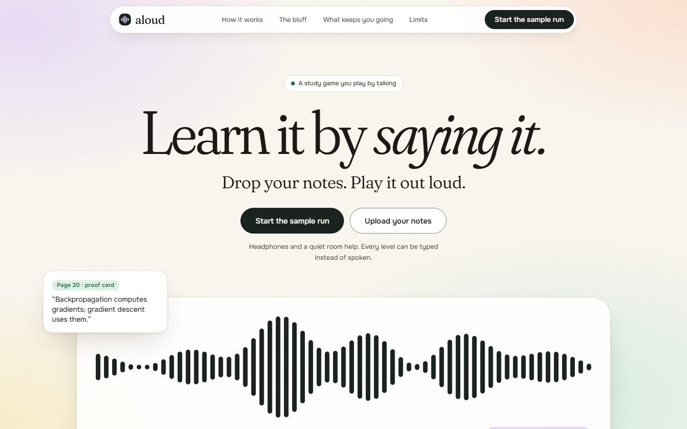
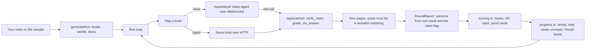

# Aloud

Learn it by saying it. Drop your notes and Aloud turns them into a run of 12 to 30 spoken levels. In one kind of level the examiner lies to you with a claim that sounds right, and you catch it with the page as proof.



Entry for the lablab AssemblyAI Voice Agent Hackathon. The examiner is the AssemblyAI Voice Agent API. The claim checking, scoring and level generation are code in this repository.

## Try it

- Live: `[LIVE_URL]` (not deployed yet as of 2026-09-30, see [docs/HUMAN-TODO.md](docs/HUMAN-TODO.md)).
- Locally, three commands (Node 20 or later):

```
npm ci
cp .env.example .env.local    # set ASSEMBLYAI_API_KEY (voice) and the LLM_* names (grading); keys stay on the server
npm run dev                   # http://localhost:3000, press "Start the sample run"
```

No sign-in. Every level can be typed instead of spoken. Voice needs a microphone, HTTPS or localhost, and an AssemblyAI key.

## What you play

1. Drop notes (PDF, text, paste) or start the sample run. The sample is a set of Transformers notes written for this project. It builds a run of 22 levels in 5 worlds (10 Say it, 7 Catch it, 5 Boss), the same every time.
2. Levels come in four kinds. **Say it**: explain a concept, the examiner follows up, code grades you against your pages. **Catch it**: the examiner states a claim from your notes, half real and half altered, and you call real or bluff. **Boss**: a mixed round at the end of each world with 4 hearts. **Recall**: concepts you missed come back as a level.
3. Hearts, XP with a combo multiplier, up to 3 stars per level, ranks 1 to 30, a daily streak with earned freezes and a daily minutes ring. The rules are in [docs/GAME-DESIGN.md](docs/GAME-DESIGN.md) and implemented in `src/lib/game/scoring.ts` and `progress.ts`.
4. A verified quote becomes a proof card: the quote is accepted only if it is a verbatim substring of the page it names.

## What is verified

Every row names a command and a file. Status: **verified-live** means it ran against the real service (AssemblyAI or the model provider) and left a file. **unit-tested** means tests cover it and nothing live does. **not done** means exactly that. Numbers are in `numbers.json`; `node scripts/verify-numbers.mjs` checks each against its file.

| Claim | Status | Reproduce | Evidence |
|---|---|---|---|
| Whole test suite: 1817 passed, 1 skipped, 110 files (2026-09-30) | unit-tested | `npx vitest run` | [output](docs/evidence/vitest.2026-09-30.txt) |
| Run generation gives 12 to 30 levels on all 26 shipped subjects, a boss ends each world, difficulty never falls | unit-tested | `npx tsx scripts/run-shape.mts` | [output](docs/evidence/run-shape.2026-09-30.txt), `tests/game-run.test.ts` |
| Scoring, streaks, freezes and progress merge follow the rules in the game brief | unit-tested | `npx vitest run tests/game-scoring.test.ts tests/game-progress.test.ts` | those two files |
| Play screens driven in Chromium through typed rounds against the real grader: check-to-result 1.7 to 6.4 s, catch tap to reveal card 81 to 160 ms, 0 axe violations on 6 screens at 390 px | verified-live (local dev server, typed input, file store) | `node scripts/shoot-play.mjs`, `node scripts/axe-play.mjs`, `node scripts/states-play.mjs` | [review](docs/evidence/visual/REVIEW-play.md), [shots](docs/evidence/visual/play) |
| Voice Agent handshake: session ready median 444 ms, first examiner audio 958 ms (n=3, 2026-09-29, synthetic learner voice, Node client) | verified-live | `ORAL_PROBE_BASE=http://localhost:3101 npx tsx scripts/probes/oral-live.mts roundtrip --runs 3` | [probe](docs/evidence/probes/oral-live-roundtrip.2026-09-29.json) |
| Barge-in: service reports speech 1286 ms after the first loud learner sample (n=3, synthetic voice, playback stubbed, so not a measured stop) | verified-live | `... oral-live.mts bargein --runs 3` | [probe](docs/evidence/probes/oral-live-bargein.2026-09-29.json) |
| `verify_claim` on 54 labelled claims: 0 false supported, 0 false contradicted, contradicted recall 0.889 (3 of 27 abstained), judge median 590 ms | verified-live | `npx tsx --env-file=.env.local scripts/probes/oral-verify-eval.mts` | [probe](docs/evidence/probes/verify-claim-live-2026-09-29.json) |
| Page proof on the sample run's 19 Catch it claims, checked by the real judge: 8 of 8 real claims come back supported with a quote and page; 7 of 11 bluffs come back contradicted with a quote and page (3 not in material, 1 wrongly supported) | verified-live (local server, model judge, 2026-09-30) | `node scripts/probes/game-claims-live.mjs --base http://localhost:3000 --out docs/evidence/probes/game-claims-live.2026-09-30.json` | [probe](docs/evidence/probes/game-claims-live.2026-09-30.json) |
| Game levels played through the real UI in Chromium against the real Voice Agent and tool route (Say it and Catch it, voice and typed): 17 levels reached the result screen, 16 voice runs, session ready median 880 ms and first examiner audio 1399 ms after the click (n=16, dev server, max 11007 ms on a route compile), tool call to result 777 ms (n=31). The microphone was a synthetic learner voice played into the page, not a human | verified-live (local dev server, 2026-09-30) | `BASE_URL=http://localhost:3261 node scripts/probes/aloud-live-drive.mjs <scenario>`, then `node scripts/probes/aloud-numbers.mjs` | [summary](docs/evidence/probes/aloud-summary.2026-09-30.json), per-run files `docs/evidence/probes/aloud-*.2026-09-30.json` |
| Barge-in inside a level: input.speech.started to interrupted reply.done median 86 ms (n=4, min 5, max 1386). Event to event at the socket, not a measured audio stop | verified-live (same setup) | `... aloud-live-drive.mjs bargein-say` | [summary](docs/evidence/probes/aloud-summary.2026-09-30.json) |
| Page proof over the live socket: 26 of 26 real catch claims came back supported, 20 of 32 planted bluffs contradicted, 6 wrongly supported, 6 not in material | verified-live (same setup) | same | [probe](docs/evidence/probes/aloud-verify-catch.2026-09-30.json) |
| A full level by voice with a human microphone in a browser | not done | none | none |
| Contrast: 43 text and edge colour pairs, 0 failing, lowest ratio 3.85 | verified | `node scripts/check-contrast.mjs` | [pairs](design/contrast-pairs.json) |
| Copy has no dashes, exclamation marks or banned phrases in student-facing strings (oral and API paths deferred) | verified | `npm run lint:copy` | [rules](scripts/lint-copy-voice.mjs) |
| Privacy inventory is generated from the code | verified | `node scripts/data-inventory.mjs --check` | [inventory](docs/evidence/data-inventory.md) |
| Live deployment | not done | none | none |

Removed from this table for lack of current evidence: the earlier front page performance figures and the 13 route axe run, both measured on the previous product's pages (see [docs/SUBMISSION.md](docs/SUBMISSION.md)).

## How it works



1. `GET /api/game/run` builds the run from the subject's concepts, exam questions, traps and page sentences. A bluff is a trap from the course or a page sentence with one fact altered (a number, an antonym, a negation, a swap). It is kept only if the same guard that checks quotes can back a contradiction for it.
2. The browser asks `GET /api/oral/session?subjectId=&levelId=` for the session config with the level block appended to the examiner prompt, and `GET /api/voice-agent/token` for a token that lives at most 600 seconds.
3. It opens a WebSocket to the Voice Agent API and streams microphone audio. The examiner states a claim or asks a question. You answer or interrupt.
4. `tool.call` events go to `POST /api/oral/tool`. The route runs the tool against your own passages and returns a verdict, a quote and a page.
5. `src/lib/game/session.ts` turns tool results and your stance into a round outcome. No function reads examiner prose. In a Catch it level the truth is the item's `isBluff` flag and the page check only supplies the proof card.
6. `scoring.ts` applies hearts, combo and XP. `progress.ts` keeps streak, rank and the concepts you missed, and `withRecall` puts those back into the run.

## How AssemblyAI is used

- **Voice Agent API** for the examiner: a browser WebSocket, 24 kHz PCM16 microphone audio up, examiner audio down.
- **Token flow**: the account key stays in one server route (`src/app/api/voice-agent/token/route.ts`). The browser gets a short-lived token per connection attempt.
- **Session config**: the first frame is `session.update` with the versioned prompt, three tools (`search_my_material`, `verify_claim`, `grade_my_answer`), key terms from your concept names and the level block.
- **Native turn detection**: only fields the turn-detection reference documents are sent (`vad_threshold`, `interrupt_response`, `interruption_delay`).
- **Tool calling** with `execution_mode: hold`: results go back as `tool.result` only when `reply.done` is the latest event.
- **Barge-in**: on `input.speech.started` the client flushes playback and drops audio that arrives after the flush.

Details and files: [docs/SUBMISSION.md](docs/SUBMISSION.md) and [docs/notes/engine.md](docs/notes/engine.md). The older study screens from the earlier product (`/study`, `/today`) still ship and use the Dictation endpoint; the game does not.

## Known limits

- The game loop was driven by voice only with a synthetic learner voice (Windows System.Speech) played into Chromium, on a local dev server. A human on a real microphone has not played it. One Catch it run heard the synthetic voice wrongly and did not finish the level (`aloud-catch-rebased-misheard.2026-09-30.json`), so recognition errors can cost a round. The 2026-09-29 voice numbers in the table come from the engine before the game layer.
- Typed Catch it rounds score from the claim's flag and your tap. The correction field is practice and is labelled not scored.
- Not every bluff gets a page proof. On the sample run 4 of 11 bluffs did not (3 the judge could not place in the notes, 1 it called supported). The round is still scored from the claim's flag, so the player loses the proof line, not points. `scripts/demo-preflight.mjs` names a catch level whose bluff is proven, and that is the level to record.
- The claim judge is a model. Code guarantees the quoted words are in the named page, not that the verdict is right. The labelled set is 54 claims over two courses, written in this repository, so 0 false supported is a small result and not a rate.
- A catch level's prompt contains which claims are bluffs and reaches the browser like the rest of the prompt. Reading it spoils your own game and changes no score, because scoring trusts the flag in the stored run.
- Recall levels, streak freezes across real days and crates are unit-tested. They were not watched across real days.
- Without `DATABASE_URL` the store is a file on the server's temporary disk and is wiped on restart. Progress is also kept in your browser, so a reload keeps it on that device.
- Text only: a scan with no text layer gives Aloud nothing to quote.
- Chromium only. No Firefox, Safari or physical phone pass. Sound cues are off by default and were not listened to.
- Legal pages are drafts marked for review. The privacy page does not yet list the browser keys the game writes (`aloud.run.*`, `aloud.progress.*`).

## Links

[Game brief](docs/GAME-DESIGN.md), [engine notes](docs/notes/engine.md), [architecture](docs/ARCHITECTURE.md) (written for the earlier product), [privacy inventory](docs/evidence/data-inventory.md), [security](SECURITY.md), [third-party licences](THIRD-PARTY.md), [licence](LICENSE).
